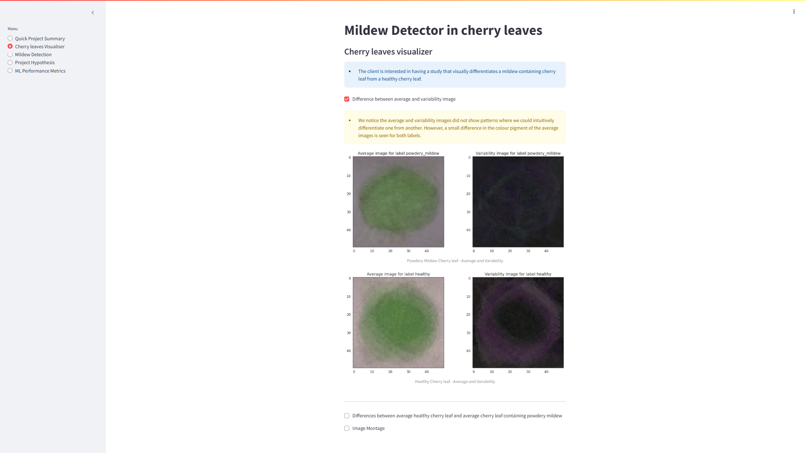

# Powdery Mildew detector in Cherry leaves

Mildew detection in Cherry leaves is a streamlit dashboard app that uses Machine Learning to produce a prediction model where the client can upload images of cherry leaves and a report is produced to indicate if those leaves contain powdery Mildew or not.


This app also visualises the cherry leaf data and compares healthy cherry leaves to cherry leaves containing powdery mildew in the following ways:
- Creating both an average image and a variability image for both healthy cherry leaves and cherry leaves containing powdery mildew.
- An image montage where the client can select from either the 'healthy' label or the 'powdery mildew' label from a drop down list and a montage of images are produced to compare images from both labels.

[View live project here!!!](https://cherry-leaf-mildew-detector-3-3672595f0fcb.herokuapp.com/)


# Contents
- [Overview](#overview)
- [Dataset Content](#dataset-content)
- [Business Requirements](#business-requirements)
- [Hypothesis](#hypothesis)
- [Project Workflow](#project-workflow)
  - [Business Understanding](#business-understanding)
  - [Data Understanding](#data-understanding)
  - [Data Preparation](#data-preparation)
  - [Data Modelling](#data-modelling)
  - [Evaluation](#evaluation)
  - [Deployment](#deployment)
- [Model Creation](#model-creation)
- [Rationale to Map Business Requirements to ML Tasks](#rationale-to-map-the-business-requirements-to-the-data-visualizations-and-ml-tasks)
- [ML Business Case](#ml-business-case)
- [Dashboard Design](#dashboard-design-streamlit-app-user-interface)
- [Bugs](#bugs)
- [Deployment on Heroku](#deployment-1)
- [Main Data Analysis and Machine Learning Libraries](#main-data-analysis-and-machine-learning-libraries)
- [Credits](#credits)


# Dataset Content
- The dataset is sourced from [Kaggle](https://www.kaggle.com/datasets/codeinstitute/cherry-leaves)  We then created a fictitious user story where predictive analytics can be applied in a real project in the workplace.
- The dataset contains 4208 images taken from the client's crop fields. The images show healthy cherry leaves(2104 images) and cherry leaves that have powdery mildew (2104 images), a fungal disease that affects many plant species. The cherry plantation crop is one of the finest products in their portfolio, and the company is concerned about supplying the market with a compromised quality product.


# Business Requirements
- The cherry plantation crop from Farmy & Foods is facing a challenge where their cherry plantations have been presenting powdery mildew. Currently, the process is manual verification if a given cherry tree contains powdery mildew. An employee spends around 30 minutes in each tree, taking a few samples of tree leaves and verifying visually if the leaf tree is healthy or has powdery mildew. If there is powdery mildew, the employee applies a specific compound to kill the fungus. The time spent applying this compound is 1 minute. The company has thousands of cherry trees located on multiple farms across the country. As a result, this manual process is not scalable due to the time spent in the manual process inspection.
- To save time in this process, the IT team suggested an ML system that detects instantly, using a leaf tree image, if it is healthy or has powdery mildew. A similar manual process is in place for other crops for detecting pests, and if this initiative is successful, there is a realistic chance to replicate this project for all other crops. The dataset is a collection of cherry leaf images provided by Farmy & Foods, taken from their crops.
    - 1 - The client is interested in conducting a study to visually differentiate a healthy cherry leaf from one with powdery mildew.
    - 2 - The client is interested in predicting if a cherry leaf is healthy or contains powdery mildew.

# Hypothesis

Powdery mildew containing cherry leaves  will have clearly showing white mildew powder that can differentiate them clearly from healthy cherry leaves.

## Validation
- I will validate the hypothesis by collecting an image dataset from the client and creating an image montage for both healthy and powdery mildew containing leaves.

- I will test the hypothesis by using image analysis:
    - I will validate the hypothesis by collecting an image dataset from the client and creating an image montage for both healthy and powdery mildew-affected leaves.
    - Creating an **average image** for both the 'powdery mildew' labelled images and the 'healthy' images label for comparison to each other.
    - Creating a **variable image** for both the 'powdery mildew' labelled images and 'healthy' labelled images for comparison to each other.

# Project Workflow
The project was carried out using CRISP-DM Process that involves six stages:
- Business understanding
- Data Understanding
- Data Preparation
- Data Modelling
- Data Evaulation

These stages have the following relationship:
<br>
<br>


### Business understanding
- The Business understanding is outlined in [ML Business case](#ml-business-case).

### Data Understanding
- Visualizing data to understand the differences between healthy and infected leaves.
- Computing average image size and variability per label.
- Plotting the mean and variability of images per label.
- Plotting a difference image between the mean images of both labels.
### Data Preparation
- Collecting data from Kaggle.
- Removing non-image files.
- Splitting data into training, validation, and testing sets.
- Loading image data and preparing it for further analysis.

### Data Modelling
- Data augmentation using ImageDataGenerator.
- Creating and training a machine learning model.
- Saving the trained model.

### Evaluation
- Evaluating model performance on the test set.
-  the learning curve for model performance.
- Making predictions on image data and interpreting the results.

### Deployment
- Set python version to 3.12.9 in runttime.txt.
- Add files not necessary for deployment in .slugignore file as to keep slug size below 500MB.
- Project is Deployed on Heroku

# Model Creation
Because the project is a binary image classification, a convolution Neural Network(CNN) was used to create a sequential prediction model to classify images as either being 'healthy' or containing 'powdery mildew'.

The model has 5 different layers:
- Conv2D
- MaxPooling2D
- Flatten
- Dense
- Dropout

### Convolution and Maxpooling layers
- Convolution layers are used to select the dominant pixel value from the non-dominant pixels in images using filters, taking a predefined image shape as its input shape.
-  Two of the Convolution layers have 32 filters and one has 64 filters and all of the convolution layers have a 3 x 3 kernel size.
- The Max-pooling layers reduce the size of image by extracting only the dominant pixels within the pool size. 
- The Convolution layers paired with the Maxpooling layers removes the nonessential part of the images and reduces complexity, therefore providing more accuracy.

- The Maxpooling layers have a kernel size of 2 x 2.

### Flatten layer
- The flatten layer is used to flatten the matrix into a vector (single list of values)
- It then feeds the data into the dense layer.
### Dense layer
- The dense layer does the mathematical operation and gives the output.
There are two dense layers in the model
    - One after the flatten layer that uses 128 nodes and a 'relu' activation function.
    - Another after the Dropout layer that uses 1 node and a sigmoid activation function.

### Dropout layer
- The Dropout value is set to 0.5 so 50% of nodes are dropped to avoid overfitting the model.

### Model compiler
- The loss, optimizer, and metrics used in the model compiler are binary cross-entropy, adam, and accuracy .

# Rationale to map the business requirements to the Data Visualizations and ML tasks

- Business requirement 1: the client is interested in conducting a study to visually differentiate a healthy cherry leaf from one with powdery mildew.

    - An **average** image and a **variability** image for both 'healthy' and 'powdery mildew' cherry leaves will be displayed on the dashboard.
    - An **average** image for 'powdery_mildwew' containing leaves and 'healthy' leaves is displayed alongside a **difference** image for comparison between the two on the dashboard.
    - An image montage is created to allow the client to view randomly selected images from either the 'powdery mildew' or 'healthy' image database.
- Business requirement 2: The client is interested in predicting if a cherry leaf is healthy or contains powdery mildew.

    - A prediction learning model is created to predict if a cherry leaf image (or images) can be classified as being healthy or containing powdery mildew.
    - The prediction model should have at least a 97% accuracy level.
    - The client can download a report of the images that they have selected in the form of an excel file.
# ML Business Case
1. What is the business objective requiring an ML solution?
    - We require an ML solution to tell whether or not a cherry leaf contains powdery mildew or is healthy.

2. Is data available for the training of the model, if yes which type of data, if no, how we are going to collect the data?
    - Previous image data categorized as 'healthy' and 'powdery mildew' is provided by Farmy & Foods. This previous image data contains 4208 images overall, with 2104 images per label.
3. Does the customer need a dashboard or an API endpoint?
    - The client needs a dashboard.
4. What does success look like for the client?
    - Sucess looks like a dashboard with all the required business output. With images that can visually differentiate healthy leaves from powdery-mildew leaves and a model predictor where the client can predict if a leaf will be healthy or contain powdery mildew.
5. Can you break down the project into Epics and User?
    - The Project can be broken down into User stories which can be found [here](https://github.com/users/Cam-4587/projects/11). 
6. Are there any Ethical or Privacy concerns?
    - The client provided the data under an NDA (non-disclosure agreement), therefore the data should only be shared with professionals that are officially involved in the project. Please see [here](https://www.kaggle.com/datasets/codeinstitute/cherry-leaves).
7. What level of prediction performance is needed?
    - The classification model has to be 97% accurate or more.
8. What are the project inputs and intended outputs?
    - The input is a cherry leaf image and the output is a prediction of whether the cherry leaf is healthy or contains powdery mildew.
9. Does the data suggest a particular model?
    - The data suggests a binary classification model, more specifically a convolution neural network.
10. how will the customer benefit?
    - It will allow cherry leaves to be quickly categorized as being healthy or containing powdery mildew.
# Dashboard Design (Streamlit App User Interface)
#### Page 1: Quick Project Summary
##### Quick project summary

- General Information
    - Farmy and Foods are facing a challenge where their cherry leaves have been presenting with powdery mildew.

    - The current process is manual verification, taking a few samples of tree leaves from a cherry tree and verifying visually if the tree leaf is healthy or not. The employee will spend 30 minutes on each tree.
    - The company has thousands of cherry trees located on multiple farms across the country. Therefore, this manual process is not scalable due to the time spent on the manual process.

    - To save time on this, the IT team suggested an ML system that instantly detects whether an image of a cherry leaf image is healthy or has powdery mildew.

- Project Dataset
    - The available dataset contains 4208 images provided by Farmy & Foods, taken from their crops. 
    - Of these images 2104 of these are healthy cherry leaves and 2104 are cherry leaves with powdery mildew.
- Business requirements
    - The client is interested in a study to differentiate between a powdery mildew contained and healthy cherry leaf.
    - The client is interested in telling whether a given cherry leaf contains powdery mildew or not.


#### Page 2: Cherry leaves Visualiser
- It will answer business requirement 1
    - Checkbox 1 - Difference between average and variability image
    - Checkbox 2 - Differences between healthy cherry leaves and cherry leaves that contain powdery midlew.
    - Checkbox 3 - Image Montage that displays a selection of images for each label, 'healthy' and 'powdery mildew'.




#### Page 3: Mildew detection
- It will answer business requirement 2
    - Link to download a set of powdery mildew contained and healthy cherry leaves.
    - A user interface to upload multiple image files. It will display the image and a prediction statement indicating if the cherry leaf is infected with powdery mildew or not and the probability associated with this statement.
    - Table with the image name and preciction results.
    - A download button to dowload the table.


#### Page 4: Project Hypothesis and Validation
- Block for each project hypothesis, describe the   conclusion and how you validated it.


#### Page 5: ML prediction Metrics
- Label Frequencies for Train, Validation, and Test Sets
- Model History - Accuracy and Losses
- Model evaluation 


# Bugs
- When I first Deployed me project to Heroku the slug size was higher than 500MB which meant the 
project couldn't be deployed.
- So in order to correct this I added the following the ```.slugignore file```
    - *.ipynb
    - *.csv
    - *.xlsx
    - `__pycache__/`
    - logs/
    - tmp/
    - datasets/
    - *.h5
- After deploying again the slug size was reduced to below 500MB and the project was successfully deployed.

- However after deploying the project on Heroku the mildew detector was not functional because ```cherry_leaves_model.h5``` in the output folder was being removed before deploying to Heroku due to ```*.h5``` in the ```.slugignore file```.
- After removing ```*.h5``` from the ```.slugignore file``` the project could be successfully deployed to Heroku with a fully functional mildew detector.

- When uploading multiple images to the Mildew detector a ```StreamlitDuplicateElementKey``` error appeared that prevented a full analysis report to be produced. This was fixed by doing the following:
    - The ```key_suffix``` parameter is used in ```plot_predictions_probabilities``` to uniquely identify each Streamlit chart component, preventing conflicts. 
    - In ```st.file_uploader```, ```key_suffix=img_pil``` ensures each chart and file upload is uniquely identifiable.


# Deployment
## Heroku
- The app live link is [here](https://cherry-leaf-mildew-detector-3-3672595f0fcb.herokuapp.com/).
- Set the runtime.txt Python version to `python-3.12.9`
- The project was deployed to Heroku using the following steps.
    1. Log in to Heroku and create an app, give it an appropriate name and select either 'United States' or 'Europe'.
    2. At the deploy tab, select Github as the deployment method.
    3. Select your respository name and click Search, Once it is found, click Connect.
    4. Select the branch you want to deploy, then click Deploy Branch.
    5. The deployment process should happen smoothly if all deployment files are fully functional. Click the button Open App on the top of the page to access your App.
    6. If the slug size is too large, then add large files not required for the app to the .slugignore file.

# Main Data Analysis and Machine Learning Libraries
- **numpy** was used to load images in an array in the data visualisation notebook
- **pandas** was used in the modelling and evaluation notebook to create a dataframe for visualising the frequency of images in train, set and validation datasets.
- **matplotlib** was used in the data visualisation notebook to show the difference between average powdery mildew containing and average uninfected cherry leaves images.
- **seaborn** was used in the data visualisation notebook to print out a scatterplot to plot average width and average height for images in the training set of images.
- **plotly** was used to create the Machine learning metrics plots that are seen on the dashboard on the ML performance metrics page on the dashboard.
- **Pillow** was used to display images in the mildew detector dashboard page.
- **streamlit** was used to create the streamlit dashboard.
- **joblib** was used to load a saved image shape embedding in the modelling and visualisation jupyter notebook.
- **scikit-learn** was used to train the machine learning model for binary classification.
- **tensorflow** was used to add Sequential, Conv2D, MaxPooling2D, Flatten, Dense, Dropout, and Activation layers to the model.
- **keras** was used for early stopping during training in the modelling and evaluation Jupyter ntoebook.

# Credits

- The project extensively referenced the [Malaria Detector](https://github.com/Code-Institute-Solutions/WalkthroughProject01) project by Code Institute.
- The project was created using the [Mildew Detection in Cherry](https://github.com/Code-Institute-Solutions/milestone-project-mildew-detection-in-cherry-leaves) template by Code Institute.
- the CRISP-DM image was taken from the following Code institute lesson [CRISP-DM Workflow](https://learn.codeinstitute.net/courses/course-v1:CodeInstitute+PA101+2021_Q4/courseware/e7f40db7fd894e808b110f2abd018842/4bb138cb6a8742e4aedb4401bf88d201/)

- The following README files included sections about the CRISP-DM workflow and Model creation that I have included in my README section. 
    - [KhanRana - PP5-mildew-detection-in-cherry-leaves](https://github.com/KhanRana/PP5-mildew-detection-in-cherry-leaves/blob/main/README.md)

    - [Porsil - mildew_detection_in_cherry_leaves](https://github.com/Porsil/mildew_detection_in_cherry_leaves/blob/main/README.md)
- The following article was helped me to add labels to my barplots [seaborn.barplot](https://seaborn.pydata.org/generated/seaborn.barplot.html).

- The following webpages helped me when altering the y-axis of the labels distribution bar plot
    - [Matplotlib - setting y-axis](https://matplotlib.org/stable/api/_as_gen/matplotlib.axes.Axes.set_ylabel.html)
    - [Stack Overflow - How to show Y axis label horizontally](https://stackoverflow.com/questions/27671748/how-to-show-y-axis-label-horizontally)

